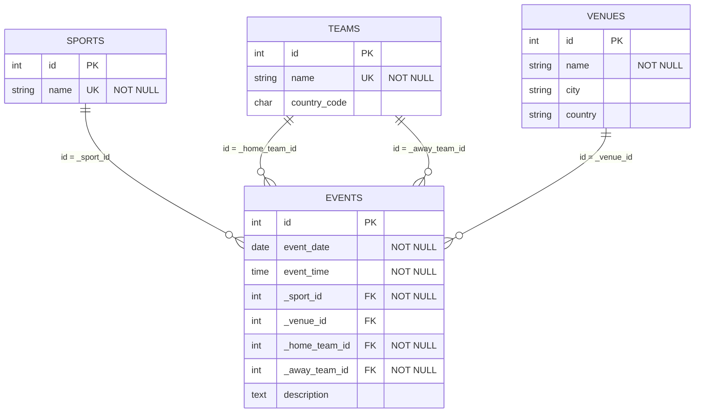

# Sports Event Calendar

Simple web application for managing and viewing sports events.

## Tech Stack

- Backend: Flask
- Database: PostgreSQL
- Frontend: HTML + CSS (Jinja templates)
- Deployment: Docker + Docker Compose

## ERD



## API endpoints

- `GET /api/events`
  - Optional query params:
    - `sport` (example: Football)
    - `date` (example: 2026-03-22)
- `GET /api/events/<id>`
- `POST /api/events`
  - JSON body example:

```json
{
  "event_date": "2026-03-22",
  "event_time": "18:30",
  "sport": "Football",
  "home_team": "Salzburg",
  "away_team": "Sturm",
  "venue_name": "Red Bull Arena",
  "venue_city": "Salzburg",
  "venue_country": "Austria",
  "description": "League match"
}
```

## Run with Docker

1. Build and start containers:

```bash
docker compose up --build
```

2. Open the app:

- http://localhost:5000


## Run locally

1. Install dependencies:

```bash
pip install -r requirements.txt
```

2. Ensure PostgreSQL is running and create database using [sql/init.sql](sql/init.sql).

3. Set environment variables (if needed):

- DB_HOST
- DB_PORT
- DB_NAME
- DB_USER
- DB_PASSWORD

4. Start app:

```bash
flask --app app.py run
```

## Assumptions and Decisions

- Team names should be globally unique. In case of duplicate names, teams should be renamed e.g. "Legia Warszawa" and "Legia Warszawa U19".
- Home and away teams must be different.
- Venue is optional e.g. for online events.
- Venue uniqueness is based on (name, city, country).
- Event uniqueness is based on (event_date, event_time, home_team_id, away_team_id).
- No multi-sport events or events with more than two teams.
- Event date and time are based on the local time, no timezone handling.
- Sample events from the assignment example are seeded in [sql/init.sql](sql/init.sql).
- Jinja templates are used for simplicity, no frontend framework as the focus is on backend and database.
- There are no error handling on the frontend.

